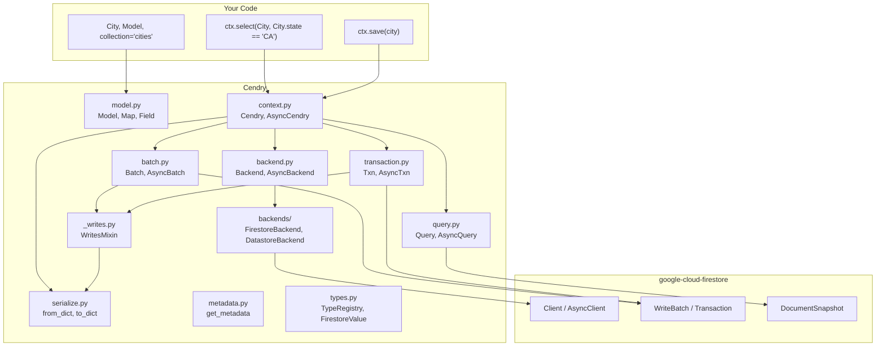
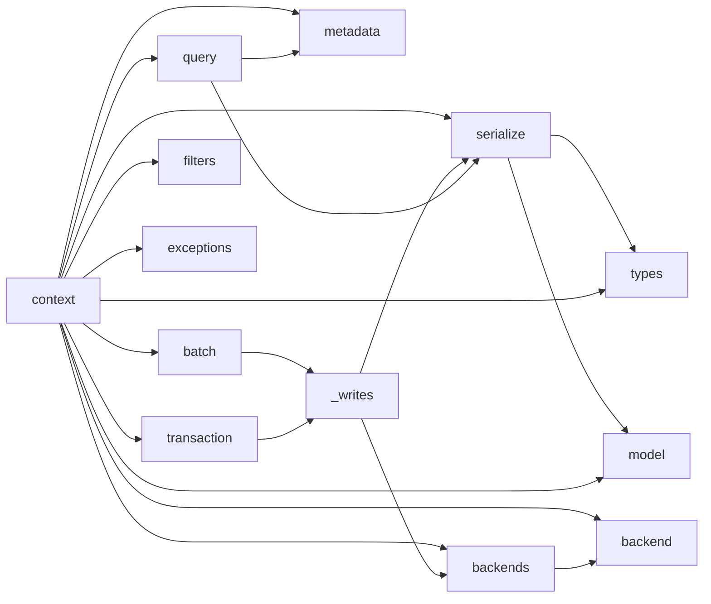
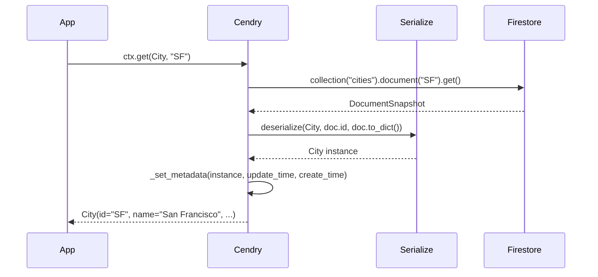
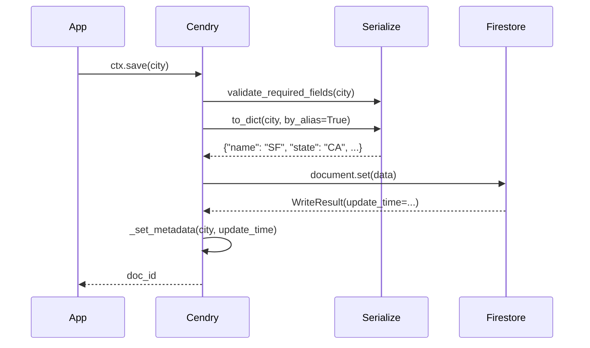
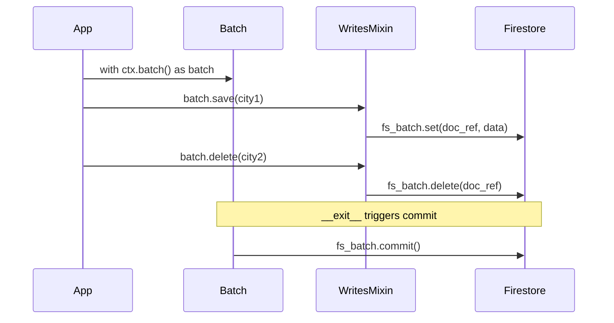
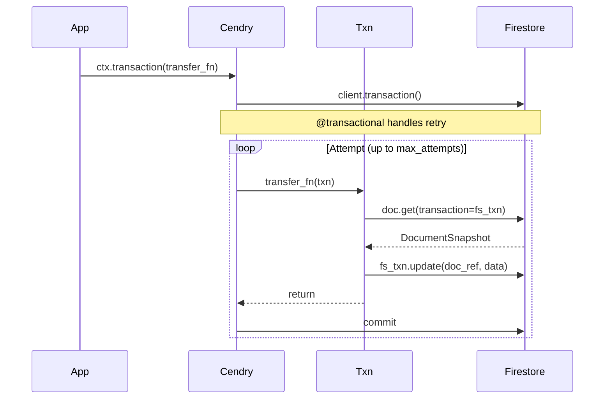

# Architecture

## Overview

Cendry is a thin wrapper over `google-cloud-firestore`. It adds typed models, composable filters, and query convenience methods without hiding Firestore's API.

## Module dependency graph

## Data flow

### Read path

### Write path

### Batch write path

### Transaction path

## Modules

### `model.py`

The core. Contains:

- **`_MapMeta`** — metaclass with `@dataclass_transform`. Rewrites `Field[T]` annotations to plain types, applies `@dataclass(kw_only=True)`, installs `FieldDescriptor` instances, and validates types via `TypeRegistry`.
- **`FieldDescriptor`** — descriptor with dual behavior: filter methods on class access, value access on instances. Tracks `owner` (model class) and `alias` (Firestore name).
- **`FieldFilterResult`** — a filter produced by descriptor methods. Carries owner and alias for repr.
- **`Field[T]`** — marker class with overloaded `__get__` for type checker support.
- **`Map`** / **`Model`** — base classes.

### `context.py`

Entry point for all Firestore operations:

- **`_BaseCendry`** — shared query-building logic, collection ref resolution.
- **`Cendry`** / **`AsyncCendry`** — sync/async contexts with `get`, `find`, `get_many`, `select`, `select_group`, `save`, `create`, `update`, `delete`, `refresh`, `batch`, `save_many`, `delete_many`, `transaction`.
- Populates metadata on every read and write.

### `query.py`

Query builder objects returned by `select()`:

- **`Query[T]`** / **`AsyncQuery[T]`** — immutable, chainable. Hold the underlying Firestore query, model class, filter applicator, and type registry.
- **`Asc`** / **`Desc`** — ordering directives.
- Populates metadata during iteration.

### `serialize.py`

Standalone functions for data conversion:

- **`deserialize`** — Firestore dict → model instance. Always reads by alias.
- **`from_dict`** — user-facing dict → model. `by_alias=False` by default.
- **`to_dict`** — model → dict.
- **`serialize_update_value`** — serialize a value for partial updates, passing sentinels through.
- **`resolve_field_path`** — resolve Python field names to Firestore aliases, recursing into nested Maps.
- **`validate_required_fields`** — raise if required fields are None.
- All accept optional `registry` parameter for custom type handlers.

### `_writes.py`

Shared write logic via `WritesMixin`:

- **`save`**, **`create`**, **`update`**, **`delete`** — used by `Batch`, `AsyncBatch`, `Txn`, `AsyncTxn`.
- Handles overloaded `update`/`delete` signatures (instance or class+ID).

### `batch.py`

- **`Batch`** / **`AsyncBatch`** — context managers wrapping Firestore's `WriteBatch`. Inherit write methods from `WritesMixin`.

### `transaction.py`

- **`Txn`** / **`AsyncTxn`** — context managers wrapping Firestore's `Transaction`. Inherit write methods from `WritesMixin`, add `get`/`find` read methods.

### `metadata.py`

- **`DocumentMetadata`** — dataclass with `update_time` and `create_time`.
- **`get_metadata`** — retrieve metadata for an instance.
- **`_set_metadata`** / **`_clear_metadata`** — internal helpers.
- Storage: `dict[int, (weakref, DocumentMetadata)]` keyed by `id(instance)`.

### `filters.py`

- **`Filter`** — base class with `__and__` / `__or__`.
- **`And`** / **`Or`** — composite filters.
- **`FieldFilter`** — re-exported from Firestore SDK.

### `types.py`

- **`FirestoreValue`** — type alias for values Firestore can natively store (`None | bool | int | float | str | bytes | datetime | GeoPoint | DocumentReference | list | dict`). Referenced in handler docstrings to guide custom type authors.
- **`TypeRegistry`** — validates `Field[T]` annotations at class definition time.
- **`default_registry`** — global singleton with built-in types, built-in handlers (`Decimal` → string, `datetime.date` → datetime at midnight UTC, `datetime.time` → datetime on epoch date), and optional third-party detection (pydantic, attrs, msgspec).

### `backend.py`

- **`Backend`** / **`AsyncBackend`** — protocols defining the contract for pluggable database backends. Every Firestore operation goes through a backend method.

### `backends/`

- **`FirestoreBackend`** / **`FirestoreAsyncBackend`** — default implementations wrapping `google-cloud-firestore`. Each method is a thin delegation (2–5 lines).
- **`DatastoreBackend`** — migration bridge for Firestore in Datastore mode. Supports the common subset and raises clear errors for Native-only features.
- **`DocResult`** / **`WriteResult`** — backend-agnostic result types.
